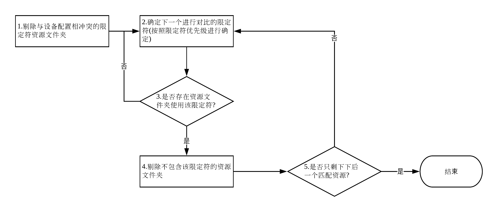

## 1.2.1 应用资源概述

> 来源：[App resources overview](app-resources-overview)
>
> 翻译参与者：[Mnilg](https://github.com/mnilg/)

[TOC]

资源是一种源码中使用的附加文件或静态内容，如[bitmap图像|layout布局|string字符串|animation]等。在使用资源过程中，需注意以下几点：

- 开发过程中，应该始终保持源码与资源文件分离，以便能够分别独立维护。
- 可以给特殊的设备配置提供替代资源文件，将其存放到对应的资源限定符文件夹中。如将字符串文件存放到`res/values-fr/ `文件夹中对应法语设备中的字符串资源。在运行时，Android会根据当前设备配置选择合适的资源文件进行加载。
- 在编译过程中，Android会在项目文件夹下生成一个`R.java`文件，其中存放了资源文件对应的资源ID，在源码中可以使用该ID访问到相应资源。

### 分组资源类型

项目中的资源文件一般都存放在`res/`目录的子文件夹中，*但不能直接存放到`res/`文件中，这样会导致编译错误*。一般`res/`目录中的子目录及其存放资源类型如下表所示：

| 目录        | 存放的资源类型                                               |
| :---------- | :----------------------------------------------------------- |
| `animator/` | 定义[属性动画](property-animation)的xml资源文件              |
| `anim/`     | 定义[补间动画](tween-animation)的xml资源文件(~~*属性动画也可以存放到该文件夹，但不推荐*~~) |
| `color/`    | 定义[颜色状态列表](color-state-list-resource)xml资源文件     |
| `drawable/` | Bitmap文件(**.png**,**.9.png**,**.jpg**,**.gif**)或者可编译成以下[Drawable资源](drawable-resource)的xml文件。 |
| `mipmap/`   | 一般用于存放启动图标Drawable资源文件。                       |
| `layout/`   | 定义[用户界面布局](layout-resource)的xml文件                 |
| `menu/`     | 定义[应用菜单](menu-resource)xml文件                         |
| `raw/`      | 保存以原始格式保存的任何文件。可以调用 [Resources.openRawResource()](resources-openrawresource)并传入资源文件id`R.raw.filename`以原始[InputStream](inputstream)打开资源文件。<br/><br/>*注：如果想要以原始文件名以及文件层次结构来访问文件，可以考虑将文件资源存放到`assets/`文件夹中，在`assets/`目录下的文件不会生成资源ID，只能通过[AssetManager](assetmanager)读取文件。* |
| `values/`   | 包含简单值的xml文件，如字符串，整数，颜色等。<br/><br/>与其他`res/`目录下的资源文件不同的是，`values/`中的单个资源文件中可以描述多个资源，`<resources>`元素中的每个子元素都对应一个资源，而其他资源文件夹下单个资源文件一般只描述一个资源。如`strings.xml`文件中每个`<string>`标签元素都对应一个资源，而`drawable/`文件下的`filename.xml`就只对应一个资源。<br/><br/>一般而言，为了保证文件的清晰性，都将不同类型的资源类型放到不同的`values`文件中。一般比较常用的文件命名定义如下：<br/>- `arrays.xml`存放[资源数组](typed-array)。<br/>- `colors.xml`存放[颜色](color-values)。<br/>- `dimens.xml`存放[尺寸](dimension-value)。<br/>- `strings.xml`存放[字符串](string-value)。<br/>- `styles.xml`存放[样式](styles)。 |
| `xml/`      | 存放任意的xml文件，可以在运行时通过[Resources.getXML()](resource-getxml)读取。各种xml配置文件必须保存在这里，如[搜索配置](searchable-configuration)。 |
| `font/`     | 存放以`.ttf`，`.otf`或者`.ttc`结尾的字体文件，或者存放以`<font-family>`元素定义的[xml字体文件](fonts-in-xml)。 |

### 提供替代资源

一般情况下，使用默认资源就能够正常运行应用；但是在某些特殊的设备配置下，必须使用替代资源以便能够更好的适配应用。如，在手机和平板两种不同设备中，使用不同布局资源来进行相应适配：

 

Android系统使用`限定符`来为不同配置的设备提供替代资源，在应用运行时，系统会根据不同的设备配置加载合适的资源。

1. 在`res/`文件夹在新建特定配置对应的资源文件夹`<resources_name>-<config_qualifier>`，如`drawable-hdpi`。
2. 将替代资源放到相应的特定配置资源文件夹中，保证资源文件名必须与默认资源文件一致。
3. 应用运行时，系统会根据`限定符`规则加载合适的资源文件。

> 为了保证应用稳定性，在提供替代资源的同时，给每种资源类型提供默认资源是一种比较好的做法。因为我们无法预测应用到底会运行在哪些设备上，如果不提供默认资源，在未兼容的设备上运行时无法找到相关资源文件，会产生崩溃。

#### <span id="qualifier_priority">系统支持的限定符及优先级</span>

Android系统根据不同的设备配置定义了很多`限定符`，并对其优先级进行了排序，具体的限定符及其优先级如下表所示 (从上至下优先级依次递减)：

| 设备配置                            | 限定符                                                       | 描述                                                         |
| :---------------------------------- | :----------------------------------------------------------- | :----------------------------------------------------------- |
| MCC和MNC                            | ` mcc310 `，` mcc310-mnc004 `，` mcc208-mnc00 `等            | - 设备SIM卡中`MCC`(Mobile Country Code，移动国家代码)通常和`MNC`(Mobile Network Code，移动网络代码)组合使用来表示唯一标志移动网络运营商，如`mcc460-mnc00`就表示中国移动。<br/>- `MNC`为可选项，可单独使用`MCC`来作为限定符，如`mcc460`表示中国区域内的移动网络运营商。<br/>*MCC和MNC全部定义值可查看[Mobile Country Code][mobile-country-code]* |
| 语言和地区                          | ` en `，` fr `，` en-rUS `，` fr-rFR `，<br/>` fr-rCA `，` b+en+US ` | - 语言代码可单独作为限定符使用，如`en`表示英语，其全部定义值可查看[ISO 639-1](iso-639-1)。<br/>- 语言代码可以与地区代码(使用`r`分隔)组合作为限定符使用，如`en-rUS`表示美国英语，地区代码全部定义值可查看[ISO 3166-1-alpha-2](iso-3166-1-alpha-2)。<br/>- Android 7.0 支持[BCP 47 language tags](bcp-47-language-tags)，可以用于限定特定语言与地区环境。使用`b`开头，并使用`+`连接[ISO 639-1](iso-639-1)语言代码等子标签，如` b+en+US `。 |
| 布局方向                            | ` ldrtl `，` ldltr`                                          | - `ldrtl` 从右到左布局。<br/>- `ldltr`  默认的布局方式，从左到右布局。 |
| smallestWidth                       | ` sw<N>dp `，如` sw320dp `                                   | smallestWidth表示屏幕宽高中最小的可用尺寸。如`sw320dp`表示应用兼容最小屏幕尺寸大于等于320dp的设备。 **无论设备屏幕方向如何改变，smallestWidth都是固定不变的。** |
| 可用高度/宽度                       | ` h<N>dp `/` w<N>dp `，如` h720dp `                          | 使用`dp`指定设备的最小可用屏幕高度/宽度，**当设备屏幕改变时，最小可用屏幕高度/宽度会随之改变。** |
| 屏幕尺寸                            | ` small `，` normal `，` large `，` xlarge `                 | - `small` 与低密度QVGA屏幕相近大小的设备，最小的small布局大小为320x426。这种屏幕有QVGA低密度和VGA高密度两种。<br/>- ` normal ` 与中等密度QVGA屏幕相近的设备，最小的normal布局大小为320x470。这种屏幕有WQVGA低密度，HVGA中密度和WVGA高密度三种。<br/>- `large` 与中等密度VGA屏幕相近的设备，最小的large布局大小为480x640。这种屏幕有VGA和WVGA中等密度屏幕两种。<br/>- ` xlarge ` 比传统中等HVGA屏幕大的设备，最小的xlarge布局大小为720x960。通常是具有超大屏幕的设备，如平板。 |
| 屏幕方面                            | ` long `，` notlong `                                        | -  ` long ` 长屏幕，如 WQVGA, WVGA, FWVGA <br/>- ` notlong ` 非长屏幕，如 QVGA, HVGA, and VGA <br/>长与非长的概念完全取决于屏幕的长宽比(长屏幕更宽)，与设备的方向无关。 |
| 圆形屏幕                            | ` round `，` notround `                                      | - ` round ` 圆形屏幕，如圆形可穿戴设备。<br/>- ` notround ` 矩形屏幕，如手机/平板等。 |
| 广色域(Wide Color Gamut ,WCG)       | ` widecg `，` nowidecg `                                     | - ` {@code widecg} ` 能够显示如Display P3或者 AdobeRGB 之类广泛色域。<br/>- ` {@code nowidecg} ` 显示比较窄的色域，如sRGB。 |
| 高动态范围( High Dynamic Range,HDR) | ` highdr `，` lowdr `                                        | - ` {@code highdr}` 高动态范围显示器<br/>- ` {@code lowdr}` 低/标准动态范围显示器 |
| 屏幕方向                            | ` port `，` land `                                           | - ` port ` 设备处于纵向<br/>- ` land ` 设备处于横向          |
| UI模式                              | ` car `，` desk `，` television `<br/>，` appliance `，` watch `，` vrheadset ` | - ` car ` 车载系统模式<br/>- ` desk ` 桌面系统设备<br/> - ` television ` 电视屏幕设备<br/> - ` appliance ` 作为器具的设备，没有用户界面<br/>- ` watch ` 可穿戴模式<br/>- ` vrheadset ` 虚拟显示设备模式 |
| 夜间模式                            | ` night `，` notnight `                                      | - ` night ` 夜间模式<br/>- ` notnight ` 白天模式             |
| 屏幕像素密度(dpi)                   | ` ldpi `，` mdpi `，` hdpi `，` xhdpi `<br/>，` xxhdpi `，` xxxhdpi `，` nodpi `<br/>，` tvdpi `，` anydpi `，` nnndpi ` | - ` ldpi ` 低密度屏幕，120dpi<br/>- ` mdpi ` 中密度屏幕，160dpi<br/>- ` hdpi ` 高密度屏幕，240dpi<br/>- ` xhdpi `超高密度屏幕，320dpi<br/>- ` xxhdpi `超高密度屏幕，480dpi<br/>- ` xxxhdpi ` 超高密度屏幕，仅适用于启动图标，640dpi<br/>- ` nodpi ` 用于不想缩放以匹配设备密度的Bitmap资源<br/>- ` tvdpi ` 介于`mdpi`和`hdpi`之间，主要用于电视屏幕。<br/>- ` anydpi ` 匹配所有密度屏幕，由于其他密度限定符。<br/>- ` nnndpi ` 用于非标准密度，其中`nnn`表示正整数。 |
| 触摸屏类型                          | ` notouch `，` finger `                                      | - ` notouch ` 不支持屏幕的设备<br/>- ` finger ` 通过手指方向来进行交互的触摸屏。 |
| 键盘可用性                          | ` keysexposed `，` keyshidden `，` keyssoft `                | - ` keysexposed ` 设备有可用键盘。如果设备具有可用软键盘，即便硬键盘没有暴露给用户甚至无可用硬键盘，均可以使用该属性功能；如果设备无可用或者禁用软键盘，就只有硬键盘暴露给用户才可用。<br/>- ` keyshidden ` 设备未启用软键盘，只有硬键盘可用且对用户是隐藏的。<br/>- ` keyssoft ` 无论对用户是否可见，设备有可用软键盘。 |
| 主要文本输入方式                    | ` nokeys `，` qwerty `，` 12key `                            | - ` nokeys ` 设备没有用于文本输入的硬件按键盘。<br/>- ` qwerty ` 无论是否对用户可见，设备有一个硬件qwerty按键盘 。<br/>- ` 12key ` 无论对用户是否可见，设备有一个硬件12键按键盘。 |
| 导航键可用性                        | ` navexposed `，` navhidden `                                | - ` navexposed ` 导航键可供用户使用。<br/>- ` navhidden ` 导航键不可用。 |
| 非触摸导航方式                      | ` nonav `，` dpad `，` trackball `，` wheel `                | - `  nonav ` 除了触摸屏之外设备没有其他导航方式。<br/>- ` dpad ` 设备有一个dpad方向键盘用于导航。<br/>- ` trackball ` 设备有一个用于导航的轨迹球。<br/>- ` wheel ` 设备具有用于导航的定向wheel。 |
| 平台版本                            | 如`v3`，`v4`，`v7`等                                         | 设备支持的API级别。                                          |

#### 限定符名称规则

- 可以使用多个限定符描述资源集，限定符之间通过`-`连接，如`drawable-en-rUS-land `表示该资源应用于横向的美式英语设备上。
- 多个限定符连接顺序必须按照限定符的优先级排列。如`drawable-hdpi-port/ `是一种错误的描述方式，其正确描述为`drawable-port-hdpi/ `。
- 替代资源目录与默认资源目录平级，不能进行嵌套。如`res/drawable/drawable-en/ `是一种错误的表示方式，`drawable-en`和`drawable`应该为平级。
- 资源目录文件夹不区分大小写，编译器会将所有的资源文件夹转换为小写以避免在某些不区分大小写的系统上出现问题，项目中的资源目录中的大小写区分只是为了保证可读性。
- 每个资源文件夹每种限定符只支持一个值。比如说想要在Spain和France环境下使用相同的drawable资源，就不能使用`drawable-rES-rFR/`表示资源运用于西班牙和法语环境，只能使用`drawable-rES/ `和`drawable-rFR/ `分开表示两种环境的资源。

#### 创建别名资源

如果想要将某个资源用于多种设备配置(不作为默认资源提供)，这样可以使用以下2种方式来实现：

- 按照一般思路来讲，可以讲该资源文件放到多个替代资源文件夹中。这种方式存在很明显的缺陷，后期可维护性难度大，想要维护资源文件，就必须对所有引用相同的资源文件夹进行维护。
- 在默认资源文件夹中放入想要用于多种设备配置的资源，然后在替代资源文件夹中创建别名资源指向真正想要引用的资源文件。相比较第一种而言，该方式具有好的可维护性，维护资源文件时，只需要对默认资源文件夹中的资源进行维护。


##### Drawable

Drawable资源创建别名资源有2种方式，比如说开发的应用icon为`icon.png`，但是在`English-Canadian `和`French-Canadian `中应用icon为`icon_ca.png`。创建别名资源并编译后，就可以使用`R.drawable.icon`来引用该资源，该资源真实指向`R.drawable.icon_ca`。

1.创建`drawable-en-rCA `和`drawable-fr-rCA `两个替代资源文件夹，使用`<bitmap>`标签创建一个指向`icon_ca.png`的drawable资源，并将资源文件命名为`icon.xml`。

```xml
<?xml version="1.0" encoding="utf-8"?>
<bitmap xmlns:android="http://schemas.android.com/apk/res/android"
    android:src="@drawable/icon_ca" />
```

2.在`values-en-rCA `和`values-fr-rCA `文件夹中新建`drawables.xml `资源文件，并使用`<drawable>`标签新建`icon_ca.png`资源文件的别名。

```xml
<?xml version="1.0" encoding="utf-8"?>
<resources>
    <drawable name="icon">@drawable/icon_ca</drawable>
</resources>
```


##### Layout

```xml
<?xml version="1.0" encoding="utf-8"?>
<merge>
    <include layout="@layout/main_ltr"/>
</merge>
```

使用`<include>`引用已存在的layout资源文件`R.layout.main_ltr`，并使用`<merge>`元素包裹，保存为`main.xml`，就创建了一个指向`R.layout.main_ltr`的别名资源文件`R.layout.main`。


##### 简单值资源文件

```xml
<?xml version="1.0" encoding="utf-8"?>
<resources>
    <string name="hello">Hello</string>
    <string name="hi">@string/hello</string>
</resources>
<?xml version="1.0" encoding="utf-8"?>
<resources>
    <color name="red">#f00</color>
    <color name="highlight">@color/red</color>
</resources>
```

### 访问应用资源

在编译期间，`aapt`会根据`res/`目录下的资源生成`R.class`类，其中包含所有的资源ID。每种资源类型都会生成`R.class`文件中的一种字类，如`R.drawable`对应所有的Drawable资源，并且每个资源文件都对应一个独立的资源ID，每个资源ID都由 ***资源类型*** 和 ***资源名称*** 组成。

#### 在代码中访问应用资源

```
[<package_name>.]R.<resource_type>.<resource_name>
```

- `<package_name>`：引用资源所在的包名(同一包名下引用不需要)。
- `<resource_type>`：资源类型对应的R子类。
- `<resource_name>`：不带后缀的资源文件名或者XML元素中的`android:name `属性值。

在代码中，可以通过以上格式访问资源文件，[Resources](resources)中提供了很多检索资源的方式，可以通过[Context.getResources()](context-getresources)获取Resources实例。

```java
// Load a background for the current screen from a drawable resource
getWindow().setBackgroundDrawableResource(R.drawable.my_background_image) ;

// Set the Activity title by getting a string from the Resources object, because
//  this method requires a CharSequence rather than a resource ID
getWindow().setTitle(getResources().getText(R.string.main_title));

// Load a custom layout for the current screen
setContentView(R.layout.main_screen);

// Set a slide in animation by getting an Animation from the Resources object
mFlipper.setInAnimation(AnimationUtils.loadAnimation(this,
        R.anim.hyperspace_in));

// Set the text on a TextView object using a resource ID
TextView msgTextView = (TextView) findViewById(R.id.msg);
msgTextView.setText(R.string.hello_message);
```

#### 在XML中访问应用资源

```
@[<package_name>:]<resource_type>/<resource_name>
```

```xml
<!--定义的XML资源-->
<?xml version="1.0" encoding="utf-8"?>
<resources>
   <color name="opaque_red">#f00</color>
   <string name="hello">Hello!</string>
</resources>
<!--引用XML资源-->
<!--@color/opaque_red-->
<!--@string/hello-->
<?xml version="1.0" encoding="utf-8"?>
<EditText xmlns:android="http://schemas.android.com/apk/res/android"
    android:layout_width="fill_parent"
    android:layout_height="fill_parent"
    android:textColor="@color/opaque_red"
    android:text="@string/hello" />
    
<!--引用其他包下资源-->
<!--@android:color/secondary_text_dark-->
<?xml version="1.0" encoding="utf-8"?>
<EditText xmlns:android="http://schemas.android.com/apk/res/android"
    android:layout_width="fill_parent"
    android:layout_height="fill_parent"
    android:textColor="@android:color/secondary_text_dark"
    android:text="@string/hello" />
```

##### 引用样式属性

除了正常的xml资源引用之外，Android还支持引用样式属性，样式属性资源允许应用引用当前主题中的属性值。通过引用样式属性，可以通过设置样式来自定义UI元素外观，以匹配当前主题提供的标准变体，这样方式能够避免资源硬编码，更方便的进行主题切换。引用语法如下所示：

```
?[<package_name>:][<resource_type>/]<resource_name>
```

```xml
<EditText id="text"
    android:layout_width="fill_parent"
    android:layout_height="wrap_content"
    android:textColor="?android:textColorSecondary"
    android:text="@string/hello_world" />
```

> android:textColor属性使用当前主题中的android:textColorSecondary属性，当进行主题切换需要修改android:textColor的颜色时，只需要自定义android:textColorSecondary，值就能够快速切换，不需要修改其他任何代码。

#### 访问原始资源文件

在`res/`目录下的资源文件，大多数都只能通过资源ID访问。如果需要访问原始资源文件，可以通过以下2种方式实现：

- 将资源文件存储到`assets/ `资源目录中，该目录中的资源文件不会生成资源ID，可以类似普通文件系统一样查询`assets/`文件夹下的文件并通过[AssetManager](asset-manager)读取该文件夹下的原始文件。
- 如果只需要读取原始数据(如Video和Audio文件)，可以将文件放到`res/raw`文件夹，并通过[openRawResource()](openRawResource)读取字节流。

#### Android如何寻找最佳匹配资源？

在应用提供了替代资源后，Android按照以下流程寻找最佳匹配资源：



比如说，应用中提供了以下替代资源：

```
drawable/
drawable-en/
drawable-fr-rCA/
drawable-en-port/
drawable-en-notouch-12key/
drawable-port-ldpi/
drawable-port-notouch-12key/
```

应用运行的设备信息如下所示：

```
Locale = en-GB 
Screen orientation = port 
Screen pixel density = hdpi 
Touchscreen type = notouch 
Primary text input method = 12key
```

系统就通过以下步骤来完成筛选：

- 剔除与设备配置相冲突的限定符资源文件。因为设备配置为`en-GB`，与`en-GB`相冲突的所有资源文件被剔除，结果如下(1)：

  > drawable/ 
  >
  > drawable-en/
  >
  > ~~drawable-fr-rCA/~~
  >
  > drawable-en-port/
  >
  > drawable-en-notouch-12key/
  >
  > drawable-port-ldpi/
  >
  > drawable-port-notouch-12key/

- 根据优先级选择下一最高优先级限定符(2)

- 判断有没有资源文件夹包含选定的优先级限定符？(3)

  - 没有，返回第2步继续寻找最高优先级限定符。
  - 有，继续下一步(在该实例中，寻找到的资源文件夹包含的最高优先级应为语言限定符)。

- 剔除不包含此限定符的资源文件。在该实例中，就是剔除不包含`en`的资源文件，结果如下(4)：

  > ~~drawable/~~
  >
  > drawable-en/
  >
  > drawable-en-port/
  >
  > drawable-en-notouch-12key/
  >
  > ~~drawable-port-ldpi/~~
  >
  > ~~drawable-port-notouch-12key/~~

- 重复步骤2，3，4，直至剩下一个符合的资源文件，就是最佳匹配资源。其结果如下(5)：

  > ~~drawable-en/~~
  >
  > drawable-en-port/
  >
  > ~~drawable-en-notouch-12key/~~


[property-animation]:https://developer.android.google.cn/guide/topics/graphics/prop-animation.html	"Property Animations"
[tween-animation]:https://developer.android.google.cn/guide/topics/graphics/view-animation.html#tween-animation	"Tween Animations"
[color-state-list-resource]:https://developer.android.google.cn/guide/topics/resources/color-list-resource.html	"Color State List Resource"
[drawable-resource]:https://developer.android.google.cn/guide/topics/resources/drawable-resource.html	"Drawable Resources"
[layout-resource]:https://developer.android.google.cn/guide/topics/resources/layout-resource.html	"Layout Resource"
[menu-resource]:https://developer.android.google.cn/guide/topics/resources/menu-resource.html	"Menu Resource"
[resources-openrawresource]:https://developer.android.google.cn/reference/android/content/res/Resources.html#openRawResource(int)	"Resources.openRawResource()"
[inputstream]:https://developer.android.google.cn/reference/java/io/InputStream.html	"InputStream"
[assetmanager]:https://developer.android.google.cn/reference/android/content/res/AssetManager.html	"AssetManager"
[typed-array]:https://developer.android.google.cn/guide/topics/resources/more-resources.html#TypedArray	"Typed Array"
[color-values]:https://developer.android.google.cn/guide/topics/resources/more-resources.html#Color	"Color Values"
[dimension-value]:https://developer.android.google.cn/guide/topics/resources/more-resources.html#Dimension	"Dimension Values"
[string-value]:https://developer.android.google.cn/guide/topics/resources/string-resource.html	"String Values"
[styles]:https://developer.android.google.cn/guide/topics/resources/style-resource.html	"styles"
[resource-getxml]:https://developer.android.google.cn/reference/android/content/res/Resources.html#getXml(int)	"Resources.getXML()"
[searchable-configuration]:https://developer.android.google.cn/guide/topics/search/searchable-config.html	"Searchable Configuration"
[fonts-in-xml]:https://developer.android.google.cn/preview/features/fonts-in-xml.html	"Fonts in xml"
[mobile-country-code]:https://en.wikipedia.org/wiki/Mobile_country_code	"Mobile Country Code"
[iso-639-1]:http://www.loc.gov/standards/iso639-2/php/code_list.php	"ISO 639-1"
[iso-3166-1-alpha-2]:https://www.iso.org/obp/ui/#iso:pub:PUB500001:en	"ISO 3166-1-alpha-2"
[bcp-47-language-tags]:https://tools.ietf.org/html/bcp47	"BCP 47 language tags"
[app-resources-overview]:https://developer.android.google.cn/guide/topics/resources/providing-resources	"App resources overview"
[resources]:https://developer.android.google.cn/reference/android/content/res/Resources.html	"Resources"
[context-getresources]:https://developer.android.google.cn/reference/android/content/Context.html#getResources()	"Context.getResources()"
[asset-manager]:https://developer.android.google.cn/reference/android/content/res/AssetManager.html	"AssetManager"
[openRawResource]:https://developer.android.google.cn/reference/android/content/res/Resources.html#openRawResource(int)	"openRawResource()"